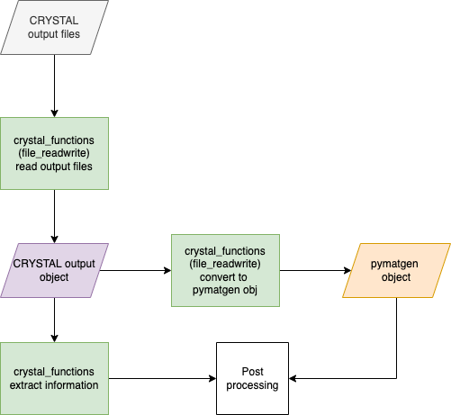

Usage
=====

The CRYSTALpytools module aims at providing the user a python interface to the CRYSTAL code. The central data structure, called ``Crystal_object``, is created by the ``crystal_io`` by parsing CRYSTAL input/output files. The flowchart below is aimed at showing how different parts of the module interact with the ``Crystal_objects``.

.. figure:: _static/crystal_object.png
   :width: 600 px
   :alt: crystal_object
   :align: center

   The general structure of CRYSTALpytools

The following flowcharts cover a wide range of workflows where CRYSTALpytools can be used. In order to run the CRYSTAL calculation, input data needs to be written to file. Nonetheless, CRYSTALpytools offers a much more approach flexible to do so.

Despite trying to be as comprehensive as possible, these flowcharts will not cover all possible scenarios. Should you have any question please feel free to contact the maintainers of this repository.

Start from a pymatgen object
~~~~~~~~~~~~~~~~~~~~~~~~~~~~

.. figure:: _static/pymatgen_start.png
   :width: 500 px
   :alt: pymatgen_start
   :align: center

   Starting a calculation from the Materials Project Database and Python in-line commands

This is the most flexible approach. Pymatgen gives the user the option to download structures from `the Materials Project database <https://pymatgen.org/pymatgen.ext.matproj.html?highlight=mprester#pymatgen.ext.matproj.MPRester>`_. 

Start from CRYSTAL input file or manually prepare the input
~~~~~~~~~~~~~~~~~~~~~~~~~~~~~~~~~~~~~~~~~~~~~~~~~~~~~~~~~~~

.. figure:: _static/crystal_start.png
   :width: 550 px
   :alt: crystal_start
   :align: center

   Staring a calculation from the CRYSTAL input file (d12/d3)

In some instances, for example when studying a material for which you already have an input file, it might be easier to create a Crystal_input object by reading the information from file. Some researchers might find it easier to manually prepare the input. This means that the input lines are specified as lists in python and then written to file using the ``write_crystal_input`` function.

Output analysis only
~~~~~~~~~~~~~~~~~~~~

   The Post-processing of CRYSTAL output files

This case applied to when the calculations were run on a different machine and the user might be interested in analysing the output. The inputs can be generated from any of the two workflows above by stopping before execution.

The functions are divided into files depending on their ultimate goal. For example, all the i/o functions are saved in 'CRYSTALpytools/crystal_io.py'. To access them, please use:

.. code-block:: python

   >>> from CRYSTALpytools.crystal_io import Crystal_output
   >>>
   >>> Crystal_output().read_cry_output('output_name.out')

Each individual function contains either 'crystal' or 'cry' in its name. This was chosen, despite making the names of the functions longer, in order to avoid ambiguity. This means that when calling a function, you will know that it refers to a CRYSTALpytools function and not, for example, a pymatgen one with a similar name.
